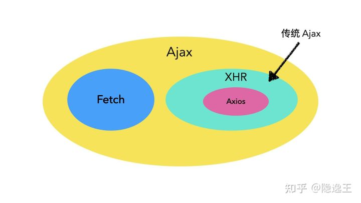

# 网络请求



## XHR

**是浏览器的原生API，利用事件监听来实现异步操作**

``` javascript
function xhrRequest(){
  const xhr = new XMLHttpRequest()
  xhr.onreadystatechange = function(){
    if(xhr.readyState===4){
      if(xhr.status>=200 && xhr.status<300){
        const obj=JSON.parse(xhr.responseText)
        //数据处理
      }
    }
  }
  xhr.open('GET/POST','url')//如果是GET方法的话，url上可加特定数据
  //xhr.setRequestHeader('Content-Type', 'application/json')//修改请求的头部信息
  //xhr.responseType="json"//服务器返回的xhr.response(json式字符串)会自动转换成对象
  xhr.send(body)//如果是GET方法的话,body就是null
}
```

## Axios

**Axios 是一个基于 promise 的网络请求库，可以用于浏览器和 node.js**

``` javascript
axios.get(url)
  .then(response=>{console.log(response)})//response对象
  .catch(error=>{console.log(error)})
```

## Fetch

**是浏览器的原生API，基于 promise**

``` javascript
fetch(url)
  .then(response => response.json())
  .then(data => console.log(data))//data对象
  .catch(error => console.log(error))

//异步函数写法
async function fetchRequest(){
  const response = await fetch(url)
  const data = await response.json()
  ////数据处理
}
```
