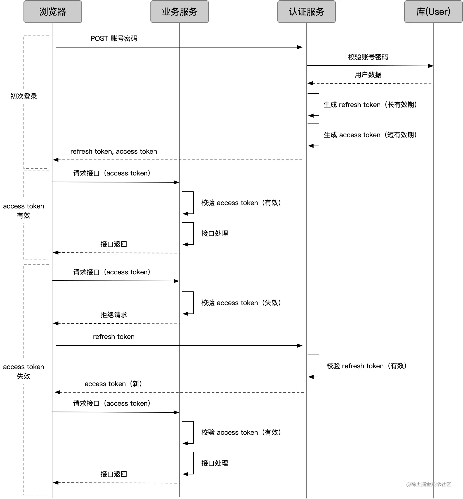

# 前端鉴权

## Token

Token最主要的功能有两个：

保证用户处于登录态无需再登录；
可以获知用户拥有什么样的权限(在后台项目中权限尤为重要)；

对于Refresh Token也失效的场景，直接重定向到登录页即可，这样保证了用户在无感知刷新的情况下修改用户的个人权限以及敏感业务权限。

## 本地存储和JSON

### 本地存储

1. **document.cookie**
- 信息量小，有安全问题
- 由服务器生成，可设置失效时间
- 如果在浏览器端生成，默认是关闭浏览器后失效
2. **window.localStorage**
- 浏览器端生成，永久保存
3. **window.sessionStorage**
- 浏览器端生成，关闭页面或者关闭浏览器后失效
4. **操作**
- **Storage.length** 返回存储在 Storage 对象中的数据项数量
- **Storage.getItem(['键名'])** 接受键名，返回键值
- **Storage.setItem(['键名'],['键值'])** 添加键值对到存储
- **Storage.removeItem(['键名'])** 移除指定的键值对
- **Storage.clear()** 清空存储的所有键值对

### JSON

- **JSON.parse() 将JSON字符串转换成js对象**
- **JSON.stringify() 将js对象转换成JSON字符串**
