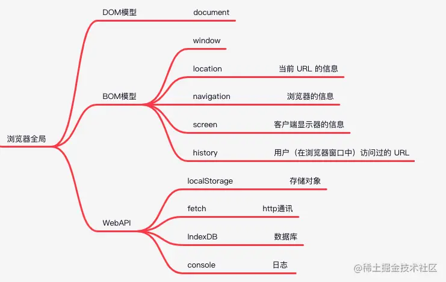

# Web API

[Web API 接口参考](https://developer.mozilla.org/zh-CN/docs/Web/API)

## 本地存储 Storage

1. **document.cookie**
- 信息量小，有安全问题
- 由服务器生成，可设置失效时间
- 如果在浏览器端生成，默认是关闭浏览器后失效
2. **window.localStorage**
- 浏览器端生成，永久保存
3. **window.sessionStorage**
- 浏览器端生成，关闭页面或者关闭浏览器后失效
4. **操作**
- **Storage.length** 返回存储在 Storage 对象中的数据项数量
- **Storage.getItem(['键名'])** 接受键名，返回键值
- **Storage.setItem(['键名'],['键值'])** 添加键值对到存储
- **Storage.removeItem(['键名'])** 移除指定的键值对
- **Storage.clear()** 清空存储的所有键值对

## fetch

## console

## web worker

## xmlhttprequest

## BOM

### window对象

window对象是浏览器环境的全局对象

- window.devicePixelRatio: 物理像素与CSS像素的比值
- window.innerWidth, window.innerHeight: 返回页面视口大小（不包括边框和工具栏）
- window.outerWidth, window.outerHeight: 返回浏览器窗口大小
- window.pageYoffset（scrollY）: 返回浏览器滚动距离
- window.open(): 导航和打开新窗口
- window.setTimeout(), window.setInterval(): 定时器
- window.alert(), window.confirm(), window.prompt():系统对话框

### location对象

Location 对象包含有关当前 URL 的信息。

#### 属性
- location.hostname; // 返回 web 主机的域名
- location.port;     // 返回 web 主机的端口 （80 或 443）
- location.protocol; // 返回所使用的 web 协议（http:// 或 https://）
- location.href;     // 返回当前页面的url地址
- location.host;     // 返回当前页面url的主机ip
- location.pathname; // 返回当前页面的路径和文件名

#### 方法
- location.assign('about:/blank') // 载入一个新文档
- location.reload() // 重新载入文档
- location.replace() // 替换

### navigator对象

Navigator 对象包含有关浏览器的信息

- navigator.appCodeName; //浏览器代码名
- navigator.appName;     //浏览器步伐名
- navigator.language;    //浏览器当前语言
- navigator.platform;    //操作体系类型win32
- navigator.plugins;
- navigator.appVersion;     //浏览器版本(包括 体系版本)
- navigator.userAgent;      //用户代理头的字符串表示
- navigator.onLine;         //用户否在线
- navigator.cookieEnabled;  //浏览器是否撑持cookie
- navigator.mimeTypes;

### screen对象

它包含客户端显示器的信息，比如像素宽度和像素高度。

- screen.availWidth;    // 返回浏览器可用宽度 像素为单位 1366
- screen.availHeight;   // 728  
- screen.availTop;      // 0
- screen.availLeft;     // 0

### history对象

表示当前窗口首次使用以来用户的导航历史记录

- history.pushstate()

## DOM

document对象是window对象的一个属性

`document === window.document      //ture`

### DOM1
- Node: 节点的属性和方法 
    - nodeType
    - nodeName, nodeValue
    - childNodes(类数组), parentNode, firstChild, lastChild, previousSibling, nextSibling
    - appendChild(): 在childNodes列表末尾添加节点, insertBefore(), replaceChild(), removeChild()
    - cloneNode()
    - normalize()
- document(是window对象的属性) 
    - document.doctype 返回 `<!DOCTYPE html>`
    - document.documentElement就是html元素
    - document.body就是body元素
    - document.title, document.URL, document.domain, document.referrer
    - document.getElementById(), document.getElementsByTagName(), getElementsByName(): 过时
    - document.anchors: 包含文档中所有带name属性的a元素, document.links: 包含文档中所有带href属性的a元素
    - document.write()
- 通过document.getElementById()等方法获得的html元素有属性和方法->读取+修改属性 
    - id, title, lang, dir, className
    - getAttribute(), setAttribute(要设置的属性名, 属性的值), removeAttribute()
- 创建元素：document.createElement("标签名")
### DOM 扩展
- document.querySelector(), document.querySelectorAll()->返回静态list
- document.getElementsByClassName()->返回动态list
- element.classList 是某元素的class属性 
    - element.classList.add(""): 向类名列表中添加指定的字符串，若存在则什么的不做
    - element.classList.remove(""): 从类名列表中删除指定字符串
    - element.classList.toggle(""): 如果类名列表中存在指定字符串，则删除；不存在则添加
- element.focus()：焦点, element.hasFocus():判断焦点是否在元素上, 返回布尔值
- document.head就是head元素
- element.innerHTML：内容操作,可改元素内的元素及内容
### DOM2/3
- element.style.(color/display等)：改元素的内联样式，style为元素的style对象
- element.style.setProperty(propertyName,value,priority["important"/""(空字符串)])，element.style.removeProperty(propertyName)
- element.style.cssText（可修改）
- document.defaultView.getComputedStyle(element, null): 获取元素的css计算样式(只读)
- document.styleSheets返回样式表节点数组，document.styleSheets.length表示数量 
    - document.styleSheets[i].cssRules: 当前样式表包含的样式规则的集合 
    - document.styleSheets[i].cssRules[i].cssText: 返回整条规则的文本
    - document.styleSheets[i].cssRules[i].selectorText: 返回这条规则的选择器
- element.offsetLeft和element.offsetTop: 返回元素对应边框相对包含元素边框的距离（像素）
- element.offsetHeight和element.offsetWidth：返回对应长度（包括滚动条、边框，内边距，内容）
- element.clientHeight和element.clientWidth：返回对应长度（包括内边距，内容）
- element.scrollHeight和element.scrollWidth: 返回没有滚动条时元素内容总长度(包括内边距，内容)
- element.scrollLeft和element.scrollTop（可设置）：返回内容区左侧相对于可见区域的长度，往右滚动有端位移
- element.getBoundingClientRect():返回一个对象,属性：left, top, right, bottom, height, width(相对视口的位置)
