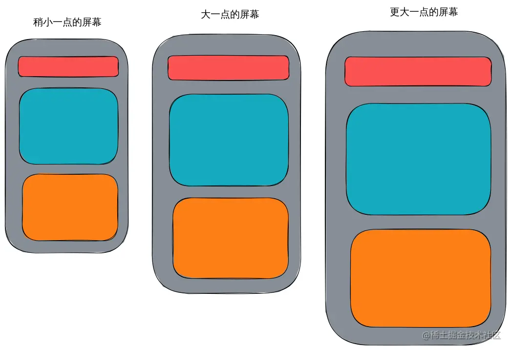
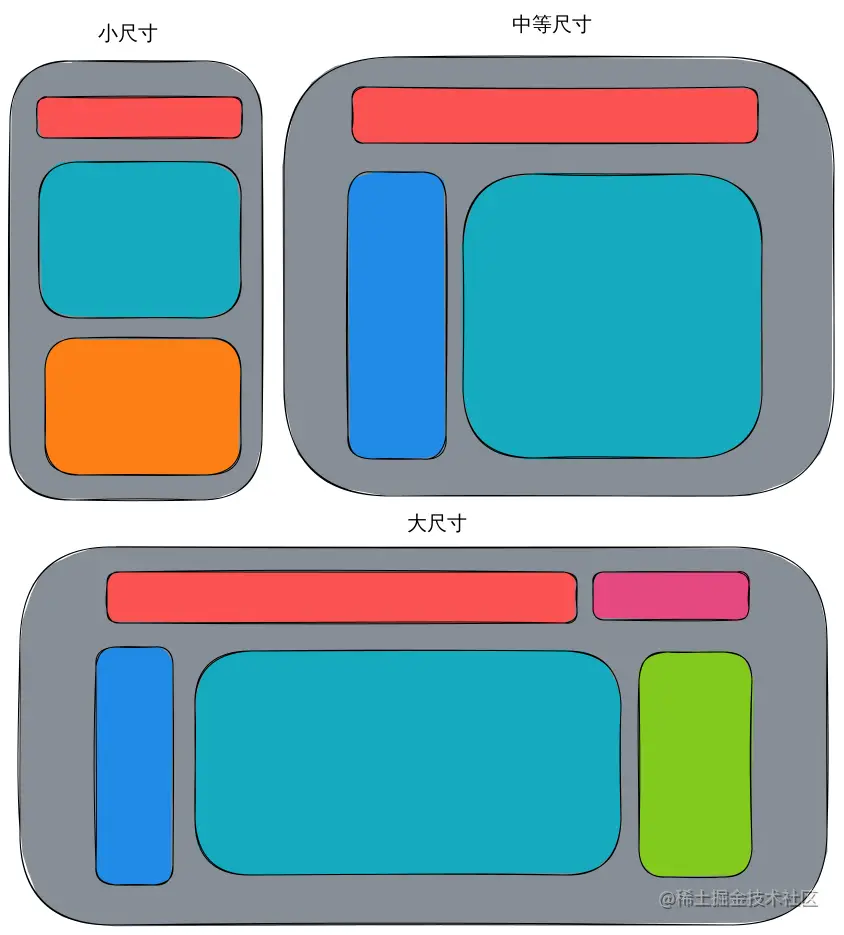

# 样式兼容

## 概念

### 物理像素

物理像素又被称为设备像素，是显示设备中一个最微小的物理部件。设备像素和设备分辨率是由操作系统来管理的，浏览器不知道、也不必知道设备分辨率的大小。​

### 逻辑像素

逻辑像素也叫设备独立像素。在页面缩放比例为1的时候，逻辑像素本质上就是CSS中的像素。在手机中，CSS像素控制的是逻辑像素而不是物理像素，因此手机和电脑设置相同的css大小的元素看起来一样。

### 设备像素比(devicePixelRatio)

设备像素比 ＝ 物理像素 / 逻辑像素，通过 window.devicePixelRatio 获取。

## 自适应

布局大致相同，仅仅元素的大小和位置发生细微改变

媒体查询用来分割区间，而 自适应 的目的 就是如何使网页在各个区间中面对不同的屏幕尺寸都能适应良好。

## 响应式

不同的设备采用不同的布局

## 解决方案

设计理念：使用大屏看的更多而不是大屏看的更大的设计来进行布局

1. HTML标签 `<meta name="viewport" content="width=device-width, user-scalable=no, initial-scale=1.0, maximum-scale=1.0, minimum-scale=1.0" />`

2. 在css中使用px。

3. 在适当的场景使用flex布局，或者配合vw/vh/vmax/vmin和百分比进行自适应。

4. 媒体查询。将数量众多的屏幕尺寸分割为几个区间。在每个不同的区间里，布局设计是完全不同的，每个区间都需要一套新的布局设计和与之对应的样式表。而在每个区间中，网页的布局是基本相同的，只有一些细微的区别。用来 分割 这些区间的 特定尺寸点 叫做 断点 (breakpoint)。
