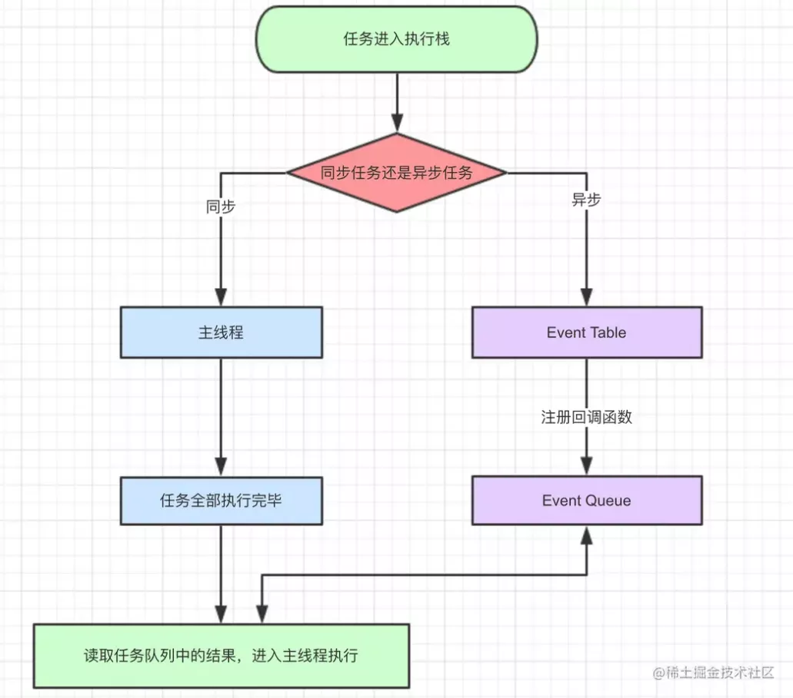
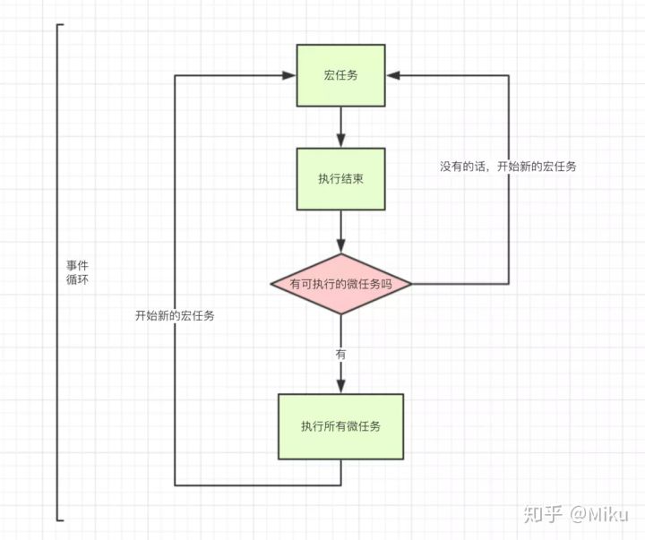

# 异步编程

## Promise

- 使用 new Promise() 创建 promise 对象时会立刻执行传入的函数
- 链式异步回调：then中返回promise对象，接着的then接收到这个promise对象执行完的resolve值
- Promise.all([Promise1,Promise2])：用于并发请求，返回一个promise对象，resolve值为对应resolve值组成的数组
```javascript
new Promise((resolve,reject)=>{
  //耗时代码
  resolve(result)
  //reject(error)//将错误直接给catch,也可以throw error
}).then(result=>{//获取上一个Promise对象的resolve值
  //对result的处理
  return result2 //返回以result2作为resolve值的新Promise对象
}).then(result2=>{
  //对result2的处理
}).catch(error=>{
  //对error的处理
}).finally(()=>{
  //不管如何都会执行的代码
})
```
## 异步函数

- async/await 是 generator 和 promise 的语法糖
- async关键字用于声明异步函数，它可以在函数声明，函数表达式还有箭头函数上使用
- 异步函数的返回值会转换成Promise 对象
- 异步函数会在遇到await时暂停，直到其运行结束再继续运行（异步调用）
- await 后接Promise对象或者原始类型的值（数值、字符串和布尔值）
   - 如果表达式是 promise 对象，await 返回的是 promise对象的resolve值
   - 如果表达式是原始类型的值，直接将此值作为 await 的返回值
```javascript
async function asyncFunc(){
  //同步代码
  await [--]
  ///同步代码
  await [--]
  //同步代码
  return 'async'
}

async function asyncFunc(){
  try{
    await new Promise((resolve,reject)=>{
      reject("Some error") 
    })
  }catch(err){
    console.warn(err)
  }
}
```
## 事件循环

- JavaScript中的任务分为同步任务和异步任务
   - 同步任务进入主线程中执行
   - 异步任务进入任务队列，等待主线程中的任务执行完成后再执行
- 异步任务分为宏任务与微任务
   - 宏任务：script(整体代码)，setTimeout，setInterval，I/O，UI交互事件，postMessage，MessageChannel，setImmediate(Node.js 环境)
   - 微任务：Promise.then，await后的代码，Object.observe，MutationObserver，process.nextTick(Node.js 环境)



- 同步和异步任务分别进入不同的执行"场所"，同步的进入主线程，异步的进入Event Table并注册函数
- 当指定的事情完成时，Event Table会将这个函数移入Event Queue
- 主线程内的任务执行完毕为空，会去Event Queue读取对应的函数，进入主线程执行
- 上述过程会不断重复，也就是常说的Event Loop(事件循环)
- 在js引擎中，存在一个叫monitoring process的进程，这个进程会不断的检查主线程的执行情况，一旦为空，就会去Event Quene检查有哪些待执行的函数



- 存在微任务的话，那么就执行所有的微任务
- 微任务都执行完之后，执行下一个宏任务
- 下一个宏任务带来多个微任务，重复第一步
