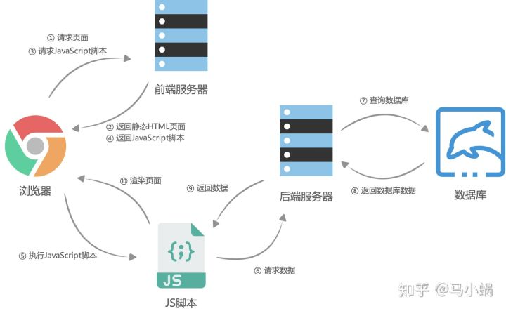
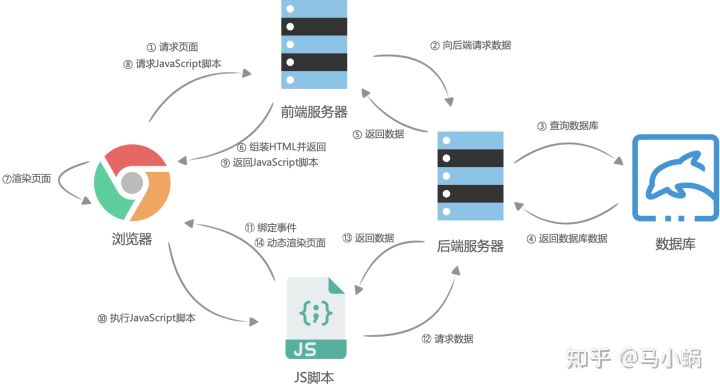

# 页面渲染

- fetch data（数据获取）
- manage state（状态管理）
- render page（页面渲染）

## 客户端渲染 CSR

1. 浏览器请求URL，前端服务器返回一个没有数据的静态HTML文件
1. 浏览器拿到HTML文件后开始加载渲染页面需要的 JavaScript 脚本和 CSS 样式表
1. JavaScript 脚本请求后端服务提供的API来获取数据，然后动态的将数据渲染到页面中

## 服务端渲染 SSR

1. 浏览器请求URL，前端服务器接收到URL请求之后，向后端服务器请求数据
1. 前端服务器获取到数据后渲染HTML文件并且返回给浏览器进行展示
1. 当用户与页面交互时，浏览器会执行 JavaScript 脚本向后端服务器请求数据并动态渲染页面
