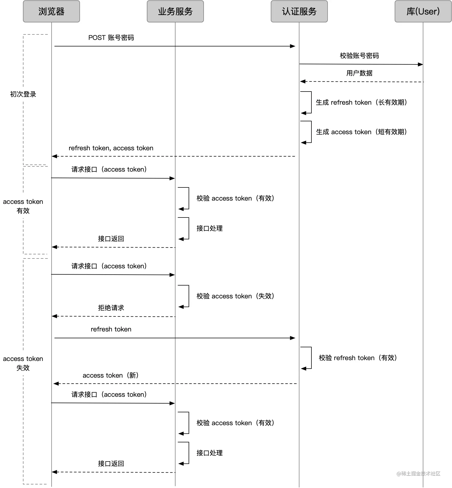

# 前端鉴权

## Token

Token最主要的功能有两个：

保证用户处于登录态无需再登录；
可以获知用户拥有什么样的权限(在后台项目中权限尤为重要)；

对于Refresh Token也失效的场景，直接重定向到登录页即可，这样保证了用户在无感知刷新的情况下修改用户的个人权限以及敏感业务权限。

## JSON

- **JSON.parse() 将JSON字符串转换成js对象**
- **JSON.stringify() 将js对象转换成JSON字符串**
