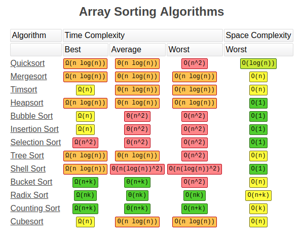

# C语言

## 编译过程
> 把源代码文件转换成可执行文件

1. 预处理：编译前先执行以 # 开头的预处理指令
- `#define` 宏定义(简单替换)
- `#include<--.h>` 或 `#include"--.h"` 引入头文件(简单复制代码)
   - 头文件中一般只包含函数的声明, 而函数的定义则在库文件中
   - `"--.h"` 先查找项目目录, `<--.h>` 先查找编译器头文件目录
   - C标准库：`stdio.h, stdlib.h(qsort, 内存管理), math.h, string.h`
2. 编译：编译器先把源代码转换成中间代码
2. 链接：链接器把中间代码、库文件代码(二进制文件)和系统代码合并
- 库文件：静态库文件(.lib), 动态库文件(.dll)
- 静态库文件代码在链接时和中间代码一起打包成程序, 动态库文件代码则不参与打包

## #define和typedef的区别

- #define是由预编译器执行的，只是简单的替换
- typedef是由编译器执行的，专门用于定义类型的别名, 是比较复杂的替换
   1. typedef 声明表达式(变量类型+变量名)
   1. 变量名充当自定义类型关键字，后接变量名即可

## 内存管理

> 以下四个内存管理函数可在 `stdlib.h` 头文件中找到  
> `void *` 类型是未确定类型的指针,可以强制类型转换为其它类型的指针  
> 以下内存操作都是在堆中进行

1. `void *calloc(int num, int size);`

在堆区动态分配num块size字节的连续空间, 且初始化为 0

2. `void *malloc(int size);`

在堆区动态分配一块 size 字节的连续空间

3. `void free(void *address);`

释放指向的动态分配内存空间, 不会将指针置空(注意: 要手动设置原指针为 `null`, 防止野指针的出现)

4. `void *realloc(void *address, int newsize);`

重新分配内存空间(可能简单扩容, 也可能换位置), 扩展到 newsize 字节的空间

## 可变参数

> 可变参数的使用需要 `stdarg.h` 头文件中的函数和宏

```c
#include<stdarg.h>
//函数参数：倒数第二个是参数个数，最后一个是三个省略号
void func([其他参数],int num,...){
	//声明va_list变量
	va_list valist;
	//初始化va_list变量
	va_start(valist, num);
	//访问va_list参数列表
	va_arg(valist, i);
	//销毁va_list变量(防止内存泄漏)
	va_end(valist);
}
```
## 排序算法



```c
void quickSort(int arr[], int low, int high){
	if(low<high){
		int i=low, j=high, pivot=arr[low];
		while(i<j){
			while(i<j && arr[j]>=pivot){
				j--;
			}
			if(i<j){
				arr[i]=arr[j];
				i++;
			}
			while(i<j && arr[i]<pivot){
				i++;
			}
			if(i<j){
				arr[j]=arr[i];
				j--;
			}
		}
		arr[i]=pivot;
		quickSort(arr, low, i-1);
		quickSort(arr, i+1, high);
	}
}
```

## 数据结构

数据元素之间存在着一种或多种关系的集合, 简单来说就是一组数据的存储结构

- 逻辑结构
   - 集合结构：数据元素之间没有任何联系, 只是属于同一个集合
   - 线性结构：数据元素之间存在一对一的序关系
   - 树结构：数据元素之间存在一对多关系
   - 图结构：也称网状结构, 数据元素之间存在多对多关系
- 物理结构
   - 顺序存储结构：用物理位置的相邻关系表示数据元素之间的逻辑关系
   - 链式存储结构：对每一个数据元素用一块较小的连续区域存放, 称为节点, 然后用指针表示逻辑关系, 在节点中设置一个或多个指针, 指向它的前驱或后继元素的地址
   - 索引存储结构：这是一种顺序加链式的存储方式, 数据元素按顺序结构存放, 然后将每个数据元素的关键字和存储地址构造一个索引表单独储存, 这种存储结构不表示元素之间的关系
   - 哈希存储结构：数据元素按顺序或链式存储, 并在数据元素的关键字与存储地址之间建立一种映射, 这种存储结构不表示元素之间的关系
